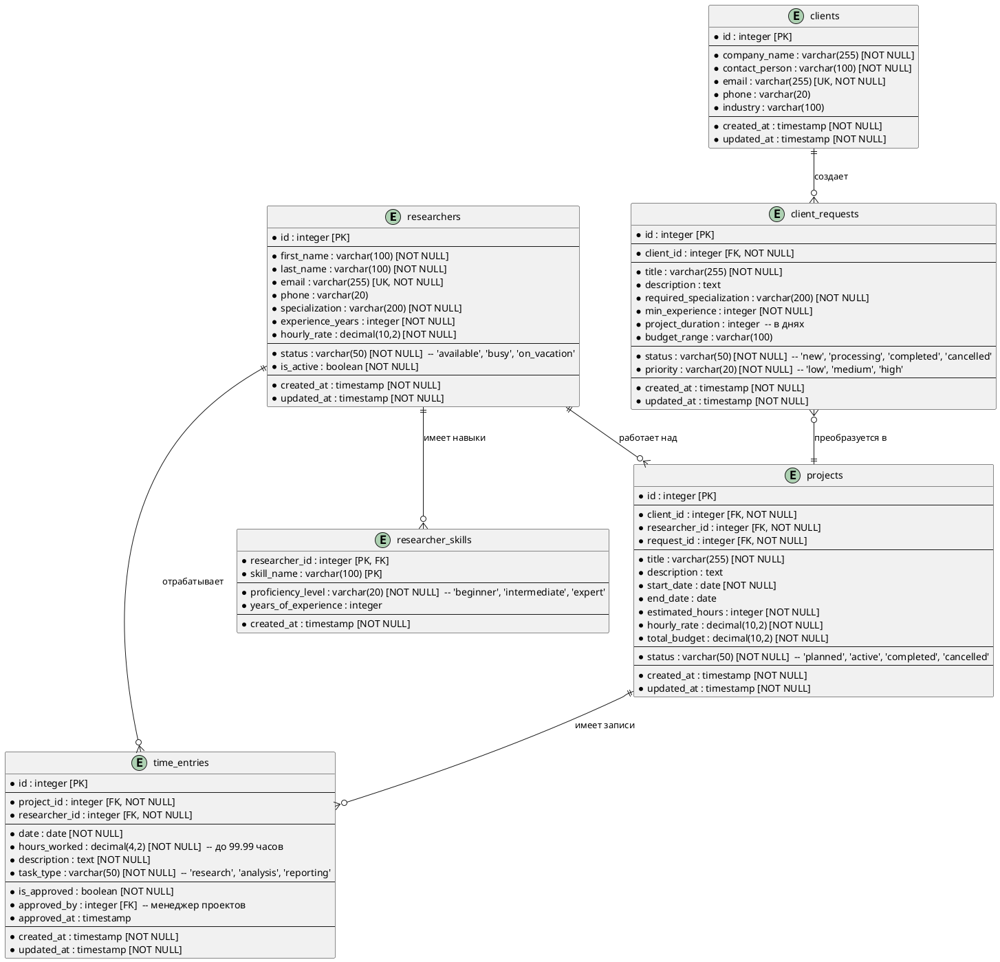

# ERD диаграмма для Research Agency

## Обзор системы
Система управления исследовательским агентством включает следующие основные сущности:
- **Исследователи** - специалисты, предоставляющие услуги
- **Клиенты** - заказчики исследовательских услуг  
- **Проекты** - исследовательские задания для клиентов
- **Запросы** - заявки от клиентов на подбор исследователей
- **Учет времени** - рабочие часы исследователей по проектам

## Диаграмма PlantUML



## SQL скрипт для базы данных

```sql
-- Создание базы данных для Research Agency
-- Файл: research_agency_database.sql

-- Таблица исследователей
CREATE TABLE researchers (
    id INTEGER PRIMARY KEY AUTOINCREMENT,
    first_name VARCHAR(100) NOT NULL,
    last_name VARCHAR(100) NOT NULL,
    email VARCHAR(255) NOT NULL UNIQUE,
    phone VARCHAR(20),
    specialization VARCHAR(200) NOT NULL,
    experience_years INTEGER NOT NULL CHECK (experience_years >= 0),
    hourly_rate DECIMAL(10,2) NOT NULL CHECK (hourly_rate > 0),
    status VARCHAR(50) NOT NULL CHECK (status IN ('available', 'busy', 'on_vacation')),
    is_active BOOLEAN NOT NULL DEFAULT TRUE,
    created_at TIMESTAMP DEFAULT CURRENT_TIMESTAMP,
    updated_at TIMESTAMP DEFAULT CURRENT_TIMESTAMP
);

-- Таблица клиентов
CREATE TABLE clients (
    id INTEGER PRIMARY KEY AUTOINCREMENT,
    company_name VARCHAR(255) NOT NULL,
    contact_person VARCHAR(100) NOT NULL,
    email VARCHAR(255) NOT NULL UNIQUE,
    phone VARCHAR(20),
    industry VARCHAR(100),
    created_at TIMESTAMP DEFAULT CURRENT_TIMESTAMP,
    updated_at TIMESTAMP DEFAULT CURRENT_TIMESTAMP
);

-- Таблица запросов клиентов
CREATE TABLE client_requests (
    id INTEGER PRIMARY KEY AUTOINCREMENT,
    client_id INTEGER NOT NULL,
    title VARCHAR(255) NOT NULL,
    description TEXT,
    required_specialization VARCHAR(200) NOT NULL,
    min_experience INTEGER NOT NULL CHECK (min_experience >= 0),
    project_duration INTEGER CHECK (project_duration > 0),
    budget_range VARCHAR(100),
    status VARCHAR(50) NOT NULL DEFAULT 'new' CHECK (status IN ('new', 'processing', 'completed', 'cancelled')),
    priority VARCHAR(20) NOT NULL DEFAULT 'medium' CHECK (priority IN ('low', 'medium', 'high')),
    created_at TIMESTAMP DEFAULT CURRENT_TIMESTAMP,
    updated_at TIMESTAMP DEFAULT CURRENT_TIMESTAMP,
    FOREIGN KEY (client_id) REFERENCES clients(id) ON DELETE CASCADE
);

-- Таблица проектов
CREATE TABLE projects (
    id INTEGER PRIMARY KEY AUTOINCREMENT,
    client_id INTEGER NOT NULL,
    researcher_id INTEGER NOT NULL,
    request_id INTEGER NOT NULL,
    title VARCHAR(255) NOT NULL,
    description TEXT,
    start_date DATE NOT NULL,
    end_date DATE,
    estimated_hours INTEGER NOT NULL CHECK (estimated_hours > 0),
    hourly_rate DECIMAL(10,2) NOT NULL CHECK (hourly_rate > 0),
    total_budget DECIMAL(10,2) NOT NULL CHECK (total_budget > 0),
    status VARCHAR(50) NOT NULL DEFAULT 'planned' CHECK (status IN ('planned', 'active', 'completed', 'cancelled')),
    created_at TIMESTAMP DEFAULT CURRENT_TIMESTAMP,
    updated_at TIMESTAMP DEFAULT CURRENT_TIMESTAMP,
    FOREIGN KEY (client_id) REFERENCES clients(id) ON DELETE CASCADE,
    FOREIGN KEY (researcher_id) REFERENCES researchers(id) ON DELETE CASCADE,
    FOREIGN KEY (request_id) REFERENCES client_requests(id) ON DELETE CASCADE
);

-- Таблица учета рабочего времени
CREATE TABLE time_entries (
    id INTEGER PRIMARY KEY AUTOINCREMENT,
    project_id INTEGER NOT NULL,
    researcher_id INTEGER NOT NULL,
    date DATE NOT NULL,
    hours_worked DECIMAL(4,2) NOT NULL CHECK (hours_worked > 0 AND hours_worked <= 24),
    description TEXT NOT NULL,
    task_type VARCHAR(50) NOT NULL CHECK (task_type IN ('research', 'analysis', 'reporting')),
    is_approved BOOLEAN NOT NULL DEFAULT FALSE,
    approved_by INTEGER,
    approved_at TIMESTAMP,
    created_at TIMESTAMP DEFAULT CURRENT_TIMESTAMP,
    updated_at TIMESTAMP DEFAULT CURRENT_TIMESTAMP,
    FOREIGN KEY (project_id) REFERENCES projects(id) ON DELETE CASCADE,
    FOREIGN KEY (researcher_id) REFERENCES researchers(id) ON DELETE CASCADE,
    FOREIGN KEY (approved_by) REFERENCES researchers(id)
);

-- Таблица навыков исследователей
CREATE TABLE researcher_skills (
    researcher_id INTEGER NOT NULL,
    skill_name VARCHAR(100) NOT NULL,
    proficiency_level VARCHAR(20) NOT NULL CHECK (proficiency_level IN ('beginner', 'intermediate', 'expert')),
    years_of_experience INTEGER CHECK (years_of_experience >= 0),
    created_at TIMESTAMP DEFAULT CURRENT_TIMESTAMP,
    PRIMARY KEY (researcher_id, skill_name),
    FOREIGN KEY (researcher_id) REFERENCES researchers(id) ON DELETE CASCADE
);

-- Индексы для оптимизации запросов
CREATE INDEX idx_researchers_status ON researchers(status, is_active);
CREATE INDEX idx_researchers_specialization ON researchers(specialization);
CREATE INDEX idx_client_requests_status ON client_requests(status);
CREATE INDEX idx_client_requests_specialization ON client_requests(required_specialization);
CREATE INDEX idx_projects_status ON projects(status);
CREATE INDEX idx_projects_dates ON projects(start_date, end_date);
CREATE INDEX idx_time_entries_date ON time_entries(date);
CREATE INDEX idx_time_entries_approved ON time_entries(is_approved);
CREATE INDEX idx_researcher_skills_skill ON researcher_skills(skill_name);

-- Триггер для автоматического обновления updated_at
CREATE TRIGGER update_researchers_timestamp 
    AFTER UPDATE ON researchers 
    FOR EACH ROW 
    BEGIN 
        UPDATE researchers SET updated_at = CURRENT_TIMESTAMP WHERE id = NEW.id; 
    END;

CREATE TRIGGER update_clients_timestamp 
    AFTER UPDATE ON clients 
    FOR EACH ROW 
    BEGIN 
        UPDATE clients SET updated_at = CURRENT_TIMESTAMP WHERE id = NEW.id; 
    END;

CREATE TRIGGER update_client_requests_timestamp 
    AFTER UPDATE ON client_requests 
    FOR EACH ROW 
    BEGIN 
        UPDATE client_requests SET updated_at = CURRENT_TIMESTAMP WHERE id = NEW.id; 
    END;

CREATE TRIGGER update_projects_timestamp 
    AFTER UPDATE ON projects 
    FOR EACH ROW 
    BEGIN 
        UPDATE projects SET updated_at = CURRENT_TIMESTAMP WHERE id = NEW.id; 
    END;

CREATE TRIGGER update_time_entries_timestamp 
    AFTER UPDATE ON time_entries 
    FOR EACH ROW 
    BEGIN 
        UPDATE time_entries SET updated_at = CURRENT_TIMESTAMP WHERE id = NEW.id; 
    END;

-- Вставка тестовых данных
INSERT INTO researchers (first_name, last_name, email, phone, specialization, experience_years, hourly_rate, status) VALUES
('Иван', 'Петров', 'ivan.petrov@example.com', '+7-999-123-45-67', 'Маркетинговые исследования', 5, 45.00, 'available'),
('Мария', 'Сидорова', 'maria.sidorova@example.com', '+7-999-123-45-68', 'Социологические исследования', 8, 60.00, 'available'),
('Алексей', 'Кузнецов', 'alexey.kuznetsov@example.com', '+7-999-123-45-69', 'Анализ данных', 3, 35.00, 'busy');

INSERT INTO clients (company_name, contact_person, email, phone, industry) VALUES
('ООО "ТехноПром"', 'Сергей Иванов', 'techprom@example.com', '+7-495-123-45-67', 'Производство'),
('АО "ФинансГрупп"', 'Ольга Смирнова', 'financegroup@example.com', '+7-495-123-45-68', 'Финансы'),
('ИП "РозницаПлюс"', 'Дмитрий Волков', 'roznitsaplus@example.com', '+7-495-123-45-69', 'Розничная торговля');

INSERT INTO researcher_skills (researcher_id, skill_name, proficiency_level, years_of_experience) VALUES
(1, 'SPSS', 'expert', 5),
(1, 'Excel', 'expert', 7),
(2, 'Qualitative Analysis', 'expert', 8),
(2, 'Focus Groups', 'intermediate', 6),
(3, 'Python', 'intermediate', 3),
(3, 'SQL', 'beginner', 2);
```

## Описание структуры базы данных

### Основные сущности:

1. **researchers** - исследователи с их профилями и ставками
2. **clients** - клиенты агентства  
3. **client_requests** - запросы от клиентов на подбор исследователей
4. **projects** - активные проекты с назначенными исследователями
5. **time_entries** - учет рабочего времени по проектам
6. **researcher_skills** - навыки исследователей (many-to-many)

### Ключевые особенности:
- Нормализация до 3NF
- Внешние ключи с каскадным удалением
- Проверки целостности данных (CHECK constraints)
- Автоматическое обновление временных меток
- Индексы для оптимизации частых запросов
- Поддержка статусов и workflow

Эта структура обеспечивает полное покрытие всех бизнес-процессов из User Stories и Use Cases.